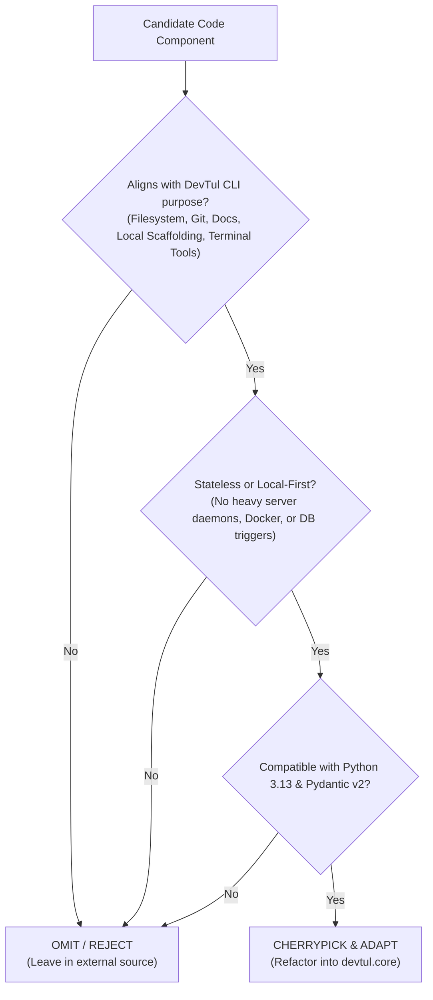

# Workflow: Code Migration & Evaluation

This workflow outlines the rigorous, repeatable procedure for evaluating external or stale repositories, selecting code for incorporation into DevTul, structuring migration branches, creating implementation plans, and recording programmatic and UAT test runs.

---

## 1. Code Selection & Evaluation Decision Matrix

When evaluating external or stale codebases (such as `controller-api`):



### Inclusion Criteria
1. **Core Domain Alignment:**
   - Enhances file decomposition (`FilePath`), cross-platform stat models (`BaseFileStat`), or line indexing (`TextFileLine`).
   - Provides standalone utility engines (such as `PiperEngine` for speech synthesis or clipboard monitors).
2. **Local-First Architecture:**
   - Operates in-process without requiring external network daemons, containers, or enterprise databases.
3. **Typing & Modern Python Parity:**
   - Written for or easily adaptable to modern Pydantic v2 and Python `>= 3.13`.

### Exclusion Criteria
1. **Microservice / Server Overhead:** FastAPI routers, Nginx configs, Docker compose files, Celery workers.
2. **Database Engine Incompatibilities:** PostgreSQL DDL triggers or complex ORM mappings that conflict with DevTul's embedded `sqlite-utils`.
3. **Third-Party Service Couplings:** Gotify, Reddit PRAW, or specific external cloud endpoints unless configured as optional plugins.

---

## 2. Branching & PR Traceability

1. **Branch Naming Standard:**
   - All code migration tasks MUST be executed on a dedicated branch following the format:
     ```bash
     feature/code-migration-<slug>
     ```
   *(Note: Ensure no flat `feature` branch ref conflict exists locally or on remote; rename or delete stale flat branches if necessary).*
2. **Issue Creation:**
   - Break the migration into focused GitHub issues using `gh issue create`.
3. **Draft Pull Request:**
   - Commit the initial implementation plan and open a draft PR linking the issues:
     ```bash
     git push -u origin feature/code-migration-<slug>
     gh pr create --draft --title "feat: code migration from <source>" --body "<Plan Checklist & Issue links>"
     ```

---

## 3. Programmatic Testing & Failure Logging

1. **Execution:**
   - Run the test suite:
     ```powershell
     uv run pytest
     ```
2. **Failure & Progression Logging:**
   - If tests fail or linting reports errors, pipe the full error output into the session's `.artifacts/` directory:
     ```powershell
     uv run pytest > .artifacts/<session-slug>/impl_test_run_1.log 2>&1
     ```
   - **Mandatory Incrementing Policy:** Every subsequent test attempt MUST increment the run index (`impl_test_run_2.log`, `impl_test_run_3.log`, etc.). NEVER overwrite an existing test log.
   - Document the root causes and remediation progression in the session's `walkthrough.md`.

---

## 4. User Acceptance Testing (UAT) Standards

User Acceptance Testing validates that the user's real-world CLI commands and workflows succeed end-to-end.

1. **UAT Scenarios:**
   - Formulate explicit commands exercising the new models and tools (e.g., testing `--no-git` path traversal, auto-detecting non-git workspaces, synthesizing audio, or decomposing text files).
2. **Recording UAT Results:**
   - Execute the UAT suite and record the verbatim command lines and output into:
     ```powershell
     .artifacts/<session-slug>/uat_test_run_1.log
     ```
   - **Mandatory Incrementing Policy:** If multiple UAT passes occur (due to bug discovery, UI adjustments, or subsequent features), each subsequent run MUST increment the run number (`uat_test_run_2.log`, `uat_test_run_3.log`, etc.). NEVER overwrite an existing UAT log file.
3. **Verification Checklist:**
   - [ ] Path tools auto-detect git vs non-git directories cleanly.
   - [ ] Internal `.git/` files are excluded from `--no-git` output.
   - [ ] New models serialize to clean JSON/YAML without runtime exceptions.
   - [ ] Zero unhandled tracebacks or stderr crashes.

---

## 5. Walkthrough & Pull Request Finalization

1. Update the session artifact `walkthrough.md` with:
   - Summary of cherrypicked models and methods.
   - Summary of programmatic test outcomes (`impl_test_run_#.log`).
   - Summary of UAT outcomes (`uat_test_run_#.log`).
2. Commit progress referencing issues:
   ```bash
   git commit -m "feat(migration): incorporate models from <source> (Closes #10, Closes #11, Closes #12)"
   git push origin feature/code-migration-<slug>
   ```
3. Update the Draft PR checklist and mark ready for review (`gh pr ready`).
