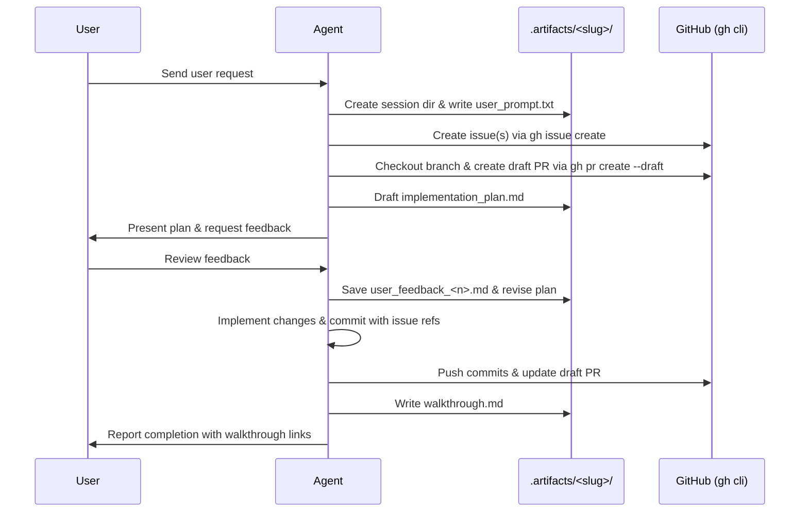

# Workflow: Session Lifecycle & Artifact Archiving

This workflow guides agents through the lifecycle of handling user requests, creating session directories, archiving verbatim user prompts, gathering review feedback, and documenting walkthroughs.

---

## Workflow Steps



---

### Step 1: Session Directory Initialization
1. Determine a concise, descriptive kebab-case slug for the user's task (e.g. `add-clipboard-tool`, `fix-tree-indentation`).
2. Create `.artifacts/<session-slug>/`.
3. Save the exact verbatim user text into `.artifacts/<session-slug>/user_prompt.txt`.

*Automated Helper Command:*
```bash
python .agents/skills/agent-ops/scripts/agent_ops.py session-init --name <session-slug> --prompt "<verbatim text>"
```

---

### Step 2: GitHub Issues & Branch Creation
1. Create one or more GitHub issues describing the work:
   ```bash
   gh issue create --title "<Title>" --body "<Detailed description>"
   ```
2. Note the issue number(s) (e.g. `#10`, `#11`).
3. Checkout a new git branch:
   ```bash
   git checkout -b <branch-name>
   ```
4. Push the branch and create a draft pull request:
   ```bash
   git push -u origin <branch-name>
   gh pr create --draft --title "<PR Title>" --body "Closes #10. Implements..."
   ```

---

### Step 3: Drafting & Presenting the Implementation Plan
1. Author `.artifacts/<session-slug>/implementation_plan.md` in the repository.
2. Include:
   - Root cause analysis or functional requirements.
   - Proposed architectural changes.
   - Checklist of tasks with markdown checkboxes (`- [ ]`).
   - Verification procedures.
3. **Present via IDE Artifact Tool:**
   - Always present the implementation plan directly to the user using the IDE `write_to_file` tool targeting `<appDataDir>\brain\<conversation-id>/implementation_plan.md` with `ArtifactMetadata` (`RequestFeedback: true`, `UserFacing: true`).
   - This renders the plan in the interactive artifact viewer with a "Proceed" button for user review and approval.

---

### Step 4: Collecting Feedback
1. Present the implementation plan to the user using the artifact tool as described above.
2. If the user provides feedback, corrections, or adjustments:
   - Save the user response verbatim into `.artifacts/<session-slug>/user_feedback_1.md`.
   - Update `implementation_plan.md` to reflect approved revisions.
   - If further iterations occur, save to `user_feedback_2.md`, `user_feedback_3.md`, etc.

*Automated Helper Command:*
```bash
python .agents/skills/agent-ops/scripts/agent_ops.py session-feedback --name <session-slug> --feedback "<user response>"
```

---

### Step 5: Implementation & Commit Linking
1. Execute the code changes according to the plan.
2. Commit with meaningful messages referencing the issue numbers:
   ```bash
   git commit -m "feat(tree): normalize path separators on Windows (Closes #10)"
   ```
3. Push progress commits to GitHub:
   ```bash
   git push origin <branch-name>
   ```
4. Update the draft PR body checklist using `gh pr edit`.

---

### Step 5b: Testing Artifact Archiving
1. **Programmatic Test Runs (`impl_test_run_<n>.log`):**
   - Save all test run outputs (especially failures and validation milestones) into `.artifacts/<session-slug>/impl_test_run_<n>.log`.
   - Each subsequent run increments `<n>` (`impl_test_run_1.log`, `impl_test_run_2.log`, etc.). Never overwrite earlier logs.
2. **User Acceptance Testing Runs (`uat_test_run_<n>.log`):**
   - Record all CLI end-to-end verification runs into `.artifacts/<session-slug>/uat_test_run_<n>.log`.
   - Each subsequent UAT pass increments `<n>` (`uat_test_run_1.log`, `uat_test_run_2.log`, etc.). Never overwrite earlier logs.

---

### Step 6: Walkthrough & Verification
1. Run linting (`uv run flake8 src tests scripts`) and tests (`uv run pytest`).
2. Write `.artifacts/<session-slug>/walkthrough.md` documenting:
   - Summary of changes across files.
   - Key test and command outputs.
   - Final status of linked issues and draft PR.
3. Present concise completion report to the user with clickable links.
