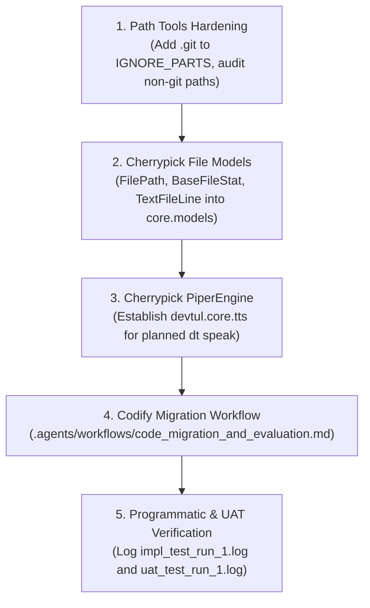

# Implementation Plan: Code Migration from controller-api & Path Tools Hardening

**Session:** `code-migration-controller-api`  
**Branch:** `feature/code-migration-controller-api`  
**Status:** In Progress  
**GitHub Issues:**  
- [#10: Fix path tools for non-git workspaces and ignore .git directory in default filters](https://github.com/Willmo103/devtul/issues/10)  
- [#11: Evaluate controller-api architecture and cherrypick file system models into DevTul](https://github.com/Willmo103/devtul/issues/11)  
- [#12: Codify code migration and evaluation workflow with programmatic & UAT testing standards](https://github.com/Willmo103/devtul/issues/12)  
- Relates to [#5: Tree command does not render tree on with no-git option](https://github.com/Willmo103/devtul/issues/5)  

---

## 1. Context & User Directives

1. **Dependency Retention (`piper-tts`, `onnxruntime`):**
   - The user explicitly clarified that `piper-tts`, `onnxruntime`, and related dependencies must **NOT** be pruned. They will power a forthcoming `dt speak` command allowing text piping, model downloading, speech rate configuration, and multi-speaker voice synthesis.
2. **Issue #5 & Non-Git Path Evaluation:**
   - **Diagnostic:** Tested `uv run dt tree --no-git`. Tree rendering indentation is now functional because `tree.py` uses `res.relative_path.as_posix()`.
   - **Crucial Defect Discovered:** When `--no-git` is executed, the entire `.git/` folder (including `hooks/`, `objects/`, `refs/`, `logs/`, and commit messages) is dumped into the tree.
   - **Root Cause:** In `devtul.core.constants.IGNORE_PARTS`, `.hg` and `.svn` are ignored, but `.git` was inadvertently omitted.
   - **Requirement:** All path tools (`tree`, `ls`, `md`, `find`, `find-folder`, `empty`, `cp`) must auto-detect git repositories and work seamlessly outside git repositories without leaking internal `.git` assets.
3. **`controller-api` Evaluation (`.agents/docs/controller-api_-_dt_markdown.md`):**
   - The user provided a 29,570-line flattened markdown dump of a stale repository `C:/src/controller-api`.
   - **Goal 1:** Model file importing and file structure representation using the rich Pydantic v2 schemas and methods from `controller-api`.
   - **Goal 2:** Evaluate and cherrypick other components (e.g. `PiperEngine` for `dt speak`, clipboard models for `dt clip`).
   - **Sub-Goal 1:** Create `.agents/workflows/code_migration_and_evaluation.md` defining strict rules for code selection, branch conventions (`feature/code-migration-<name>`), test failure logging (`impl_test_run_#.log`), and UAT recording (`uat_test_run_#.log`).

---

## 2. Evaluation of `controller-api` Components

| Component | Source Path in `controller-api` | Value Assessment for DevTul | Decision |
| :--- | :--- | :--- | :--- |
| **`FilePath`** | `src/core/models/file_system/base.py:14295` | Pydantic v2 model decomposing paths (name, stem, suffix, suffixes, parent, parents, anchor, drive, root, parts, `.Path` property). High value for robust cross-platform path handling. | **CHERRYPICK** into `devtul.core.models` |
| **`BaseFileStat` / `WindowsFileStat`** | `src/core/models/file_system/base.py:14422` | Operating-system-aware file stat extraction with ISO datetime serialization. Greatly upgrades raw `os.stat` in `FileResult`. | **CHERRYPICK** into `devtul.core.models` |
| **`TextFileLine` & `BaseTextFile`** | `src/core/models/file_system/base.py:14903` | Structured representation of file lines with line numbers, content hashing, and whitespace detection. Excellent for `dt find` and `dt md`. | **CHERRYPICK** into `devtul.core.models` |
| **`PiperEngine`** | `src/tts_service/piper_engine.py:22128` | Complete Piper speech synthesis engine supporting voice loading, synthesis configs, and WAV stream/file generation. Perfect foundation for `dt speak`. | **CHERRYPICK** into `devtul.core.tts` |
| **`files.py` utilities** | `src/core/utils/files.py:20351` | File SHA256 chunked hashing, MIME type mapping, and stat model factories. | **CHERRYPICK** into `devtul.core.file_utils` |
| **SQLAlchemy Entities / DDL Triggers** | `src/core/models/repo.py:17927` | Heavy PostgreSQL-specific tables and trigger DDL for server databases. DevTul is a local CLI backed by `sqlite-utils`. | **OMIT** (too heavy for CLI) |
| **FastAPI Routers / Docker / Nginx** | `src/controller_api/routes/` | Web server routes and microservice orchestration. | **OMIT** (out of scope for CLI tool) |

---

## 3. Implementation Steps

### Step 1: Hardening Path Tools for Non-Git Workspaces
1. Add `".git"` to `IGNORE_PARTS` in `src/devtul/core/constants.py`.
2. Verify path tools (`tree`, `ls`, `md`, `find`, `find-folder`, `empty`, `cp`):
   - Auto-detect git availability: if `.git` is present, default to git-tracked files unless overridden; if `.git` is absent, automatically fall back to filesystem traversal with default ignores.
   - Ensure paths are always normalized to POSIX representation.

### Step 2: Incorporating `controller-api` File System Models
1. Integrate `FilePath`, `BaseFileStat`, `WindowsFileStat`, `TextFileLine`, and `BaseTextFile` into `src/devtul/core/models.py`.
2. Connect `FileResult` to utilize `FilePath` and `BaseFileStat` for rich, decomposed metadata and clean JSON/YAML serialization.
3. Add `get_file_sha256` and MIME type lookup helpers to `src/devtul/core/file_utils.py`.

### Step 3: Establishing Piper TTS Engine for `dt speak`
1. Create `src/devtul/core/tts/` and implement `PiperEngine` adapted for CLI execution (downloading voices to `platformdirs.user_data_dir("devtul")/models` and synthesizing speech).
2. Wire up CLI foundation for `dt speak`.

### Step 4: Codifying the Code Migration & Evaluation Workflow
1. Author `.agents/workflows/code_migration_and_evaluation.md` specifying:
   - Decision matrix for evaluating external/stale codebases.
   - Mandatory branch convention: `feature/code-migration-<name>`.
   - Programmatic testing requirements: capturing failures in `.artifacts/<session-slug>/impl_test_run_#.log`.
   - User Acceptance Testing (UAT) requirements: capturing scenario verification in `.artifacts/<session-slug>/uat_test_run_#.log`.
   - PR documentation guidelines.

### Step 5: Programmatic & UAT Execution
1. Run `uv run pytest` and capture output.
2. Run UAT scenarios testing `dt tree --no-git`, `dt ls --no-git`, `dt md --no-git`, and model instantiations.
3. Record outputs into `impl_test_run_1.log` and `uat_test_run_1.log`.
