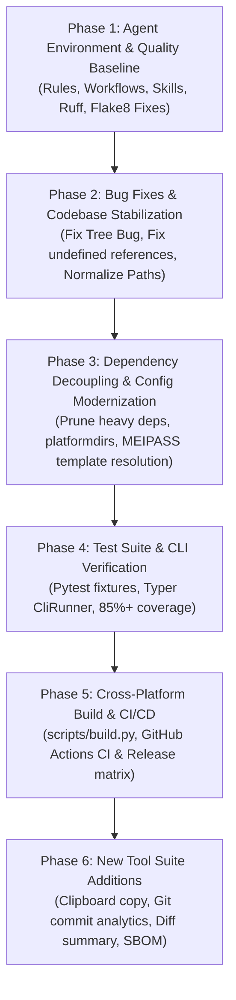

# Implementation Plan: DevTul Codebase Modernization & Cleanup

**Status:** Proposed  
**Author:** Antigravity AI Agent  
**Session:** `setup-agent-development-environment`  
**GitHub Issues:**  
- [#7: Setup agent development rules, workflows, skills, and session tracking](https://github.com/Willmo103/devtul/issues/7)  
- [#8: Develop comprehensive codebase modernization and cleanup implementation plan](https://github.com/Willmo103/devtul/issues/8)  
- [#5: Tree command does not render tree on with no-git option](https://github.com/Willmo103/devtul/issues/5)  
- [#4: CLI Argument handling needs improvement](https://github.com/Willmo103/devtul/issues/4)  

---

## 1. Executive Summary

DevTul (`dt`) is a modular developer CLI utility suite built with Typer, GitPython, and Rich for repository analysis, documentation generation, template scaffolding, and database connection tracking. Currently, the codebase exhibits signs of architectural drift:
- Heavy and non-essential dependencies (`piper-tts`, `onnxruntime`, `sympy`) bloat the virtual environment and standalone executables.
- Core commands have semi-broken edge cases (such as the Windows backslash tree formatting bug under `--no-git`, and undefined function calls in `file_utils.py`).
- Assets (Jinja2 templates, HTML reports) rely on relative file paths that fail in single-binary PyInstaller frozen environments.
- The repository lacks an automated test suite (`tests/` is unpopulated) and continuous integration.

This implementation plan outlines a structured, phased approach to stabilize, modernize, clean up, and expand DevTul into a production-grade developer tool.

---

## 2. Current Architecture & Diagnostics of Broken Components

### 2.1 The Windows Path Separator Tree Bug (`issues.md` & Issue #5)
- **File:** `src/devtul/core/file_utils.py:build_tree_structure`
- **Issue:** Uses `parts = file_path.split("/")`. On Windows with `--no-git`, file paths contain backslashes (`\`). Because `split("/")` does not split on backslashes, every directory item is treated as a flat filename at the root level, breaking indentation.
- **Solution:** Normalize all paths using `Path(p).as_posix()` prior to tree processing, or tokenize using regex `re.split(r"[\\/]", file_path)`.

### 2.2 Undefined Function Reference (`src/devtul/core/file_utils.py:311`)
- **Issue:** Function `get_files_from_marked_directories` invokes `get_all_files(...)`, which was removed in an earlier refactor.
- **Solution:** Replace the call with `gather_all_paths(marked_dir)` followed by `filter_gathered_paths_by_default_ignores(paths)`.

### 2.3 Dependency Bloat
- **Issue:** `piper-tts`, `onnxruntime`, `flatbuffers`, `numpy`, and `sympy` are included in core dependencies (`pyproject.toml`), adding >200MB of binary dependencies that are unused by core CLI operations.
- **Solution:** Remove or isolate to an optional extra (`[project.optional-dependencies] tts = [...]`).

### 2.4 Unstable Asset Resolution in Frozen Binaries
- **Issue:** In `src/devtul/core/config.py`, `_templates_dir = Path(__file__).parent / "templates"` assumes standard filesystem layout. In PyInstaller `--onefile` mode, assets are unpacked to `sys._MEIPASS`.
- **Solution:** Introduce a dynamic path resolver that checks `sys._MEIPASS` when `getattr(sys, "frozen", False)`.

### 2.5 Local Repository Pollution
- **Issue:** `dt reporter scan` writes `.devtul_cache.json` directly into the current working directory, polluting git status.
- **Solution:** Adopt `platformdirs.user_cache_dir("devtul")` for cache files and `platformdirs.user_data_dir("devtul")` for local SQLite databases.

---

## 3. Phased Implementation Strategy

### Phase 1: Agent Environment & Quality Baseline (Current Milestone)
- [x] Establish `.agents/rules/` for artifact storage, branch-based development, and issue tracking.
- [x] Establish `.agents/workflows/` for repeatable development runbooks.
- [x] Establish `.agents/skills/agent-ops/` with automation CLI for sessions, PRs, and issues.
- [x] Initialize `.artifacts/` session structure with verbatim `user_prompt.txt`.
- [ ] Migrate linting from `.flake8` to Ruff configuration in `pyproject.toml`.
- [ ] Run `ruff check --fix` and `ruff format` across `src/devtul`.

### Phase 2: Bug Fixes & Codebase Stabilization
- [ ] Fix Windows backslash splitting in `devtul.core.file_utils.build_tree_structure`.
- [ ] Fix undefined `get_all_files` in `devtul.core.file_utils.get_files_from_marked_directories`.
- [ ] Synchronize version numbering across `pyproject.toml`, `src/devtul/__init__.py`, and `src/devtul/main.py`.
- [ ] Standardize Typer exit codes and help behavior (`no_args_is_help=True` with clean output).

### Phase 3: Dependency Decoupling & Config Modernization
- [ ] Prune `piper-tts`, `onnxruntime`, `sympy`, `mpmath` from core `dependencies` in `pyproject.toml`.
- [ ] Retain database drivers under `[project.optional-dependencies]` (`pg`, `mongo`, `mysql`, `mssql`, `all-db`).
- [ ] Implement `platformdirs` for cache (`~/.cache/devtul/`) and data (`~/.local/share/devtul/` or Windows AppData).
- [ ] Implement dynamic asset resolution with `sys._MEIPASS` fallback in `devtul.core.config`.

### Phase 4: Test Suite Implementation
- [ ] Create `tests/conftest.py` with test fixtures:
  - Mock git repository with commit history and dirty working trees.
  - Temporary isolated SQLite database for user templates and connection profiles.
  - Temporary directory trees with empty files, empty directories, and marker files.
- [ ] Implement unit & integration tests using `typer.testing.CliRunner`:
  - `test_tree.py`: Tree output formatting, match/exclude filters, `--no-git` cross-platform checks.
  - `test_md.py`: Markdown document generation, frontmatter, code highlighting blocks.
  - `test_ls.py`: Listing files, JSON/YAML/CSV serialization, empty file filtering.
  - `test_empty.py`: Empty file and directory detection.
  - `test_new.py`: User template creation, listing, editing, and instantiation in SQLite.
  - `test_find.py`: Content searching and regex matching.
  - `test_copy.py`: File copying and zip archiving.

### Phase 5: Cross-Platform Standalone Build & CI/CD
- [ ] Create `scripts/build.py` using `PyInstaller.__main__.run` with dynamic `--add-data` separators (`;` on Windows, `:` on Unix).
- [ ] Create `.github/workflows/ci.yml` for automated linting, formatting, and pytest execution on PRs.
- [ ] Create `.github/workflows/release.yml` with a release matrix (Windows, Ubuntu, macOS) generating standalone binaries and SHA256 checksums.

### Phase 6: New Developer Tools to Add
1. **`dt diff` (Git Diff Summarizer & LLM Prep):**
   - Synthesizes staged or commit-range diffs with file statistics, context lines, and syntax highlighting.
2. **`dt clip` (Clipboard Formatter):**
   - Formats file contents or trees and copies directly to OS clipboard (`pyperclip` / Windows clip.exe / pbcopy / xclip).
3. **`dt stats` (Repository & Author Metrics):**
   - Summarizes commits by author, lines of code (LOC) by extension, churn rates, and contribution velocity.
4. **`dt license` (Dependency & License Auditor):**
   - Scans installed environment packages and displays license summaries for open source compliance.

---

## 4. Verification & Acceptance Criteria

1. **Lint & Formatting:** `uv run ruff check src` and `uv run ruff format --check src` pass with zero errors.
2. **Test Suite:** `uv run pytest` executes with 100% passing tests and >80% coverage on core modules.
3. **Cross-Platform Tree Generation:** `uv run dt tree --no-git` generates properly indented trees on Windows and POSIX systems.
4. **Clean Git State:** No temporary files or caches left in working repositories.
5. **Executable Verification:** `python scripts/build.py` successfully produces a standalone single-file binary that runs without external Python dependencies.
